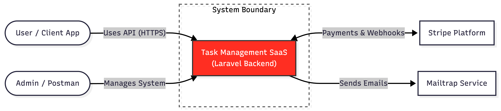
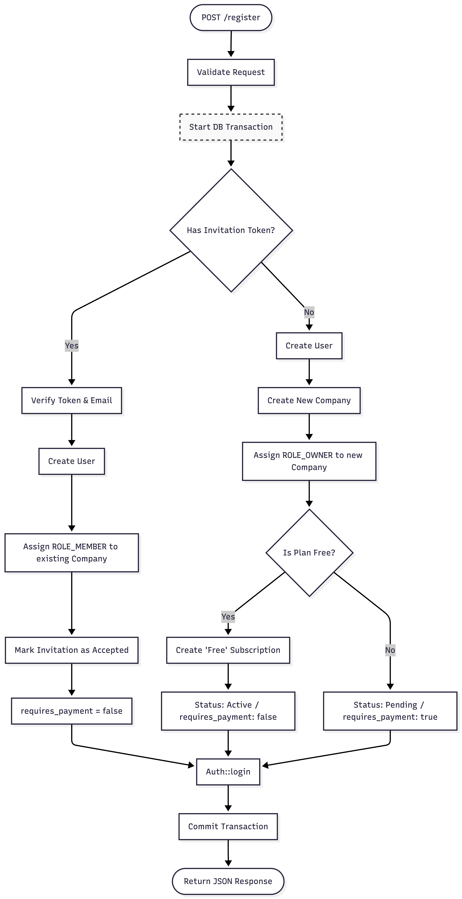
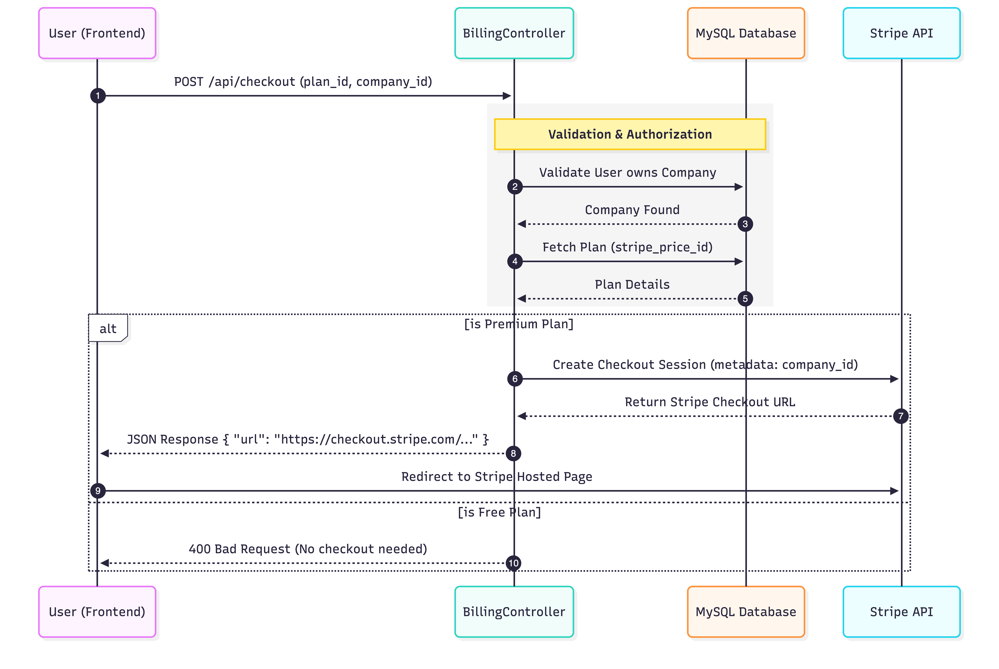
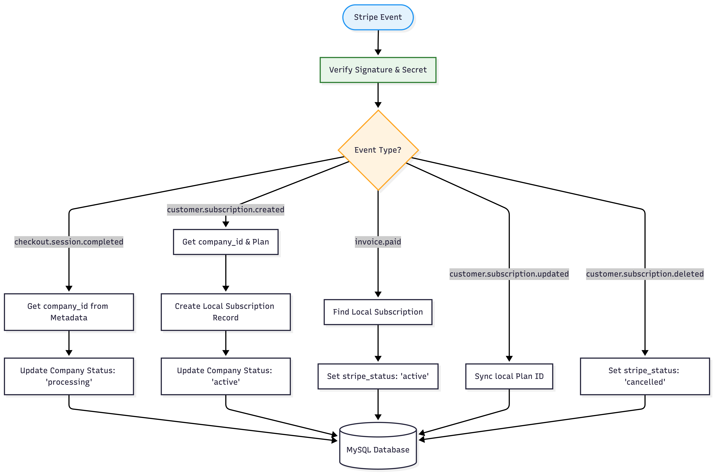
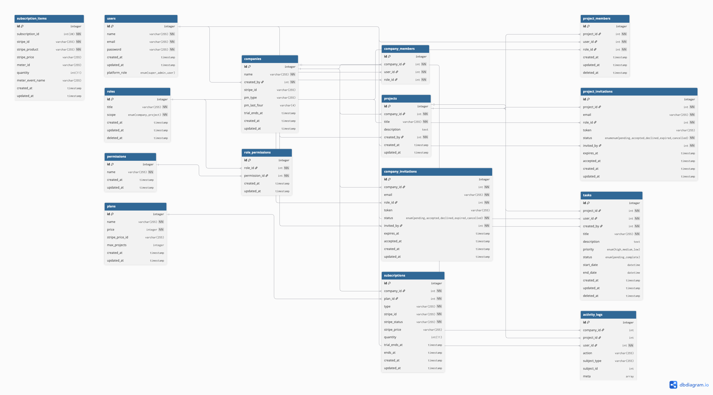

# Task Management SaaS API  
**Multi-Tenant Backend System with Stripe Subscription Billing**

---

## Overview

This project is a backend API for a SaaS-based task management platform designed for companies and teams.

The system allows organizations to register, manage team members, and subscribe to different plans (Free / Premium). Subscription billing is handled through Stripe, with a webhook-driven architecture to ensure reliable and secure payment processing.

This project focuses entirely on backend engineering, system design, and real-world SaaS architecture.

---

## Key Features

- Multi-Tenant Architecture (Company-based system)
- Role-Based Access Control (Owner, Member)
- Invitation System for team onboarding
- Email Service Integration (Mailtrap for testing emails)
- Authentication with JWT
- Stripe Subscription Integration (Laravel Cashier)
- Webhook-Based Payment Processing
- Free Plan (no payment required)
- Premium Plan with Stripe Checkout
- Subscription Status Management (pending → active → cancelled)

---

## Architecture Overview

### System Context Diagram
This diagram illustrates how the Task Management API sits at the center of the ecosystem, interacting with users and external services.

### System Layers
To maintain a clean separation of concerns, the application is organized into logical layers:
* **Controllers:** Handle incoming HTTP requests and format JSON responses.
* **Services:** Contain the core business logic (e.g., the complex `registration` and `onboarding` flows).
* **Models:** Define database relationships and Eloquent attributes.
* **Webhooks:** Dedicated handlers for asynchronous Stripe events to ensure data consistency.

---

## Subscription & Logic Flow

### 1. Registration & Onboarding
The system handles two registration paths: organic company creation (Owner) or joining an existing team via a secure invitation token (Member). The entire process is wrapped in a **Database Transaction** to ensure data atomicity.

* **Free Plan:** Company and Subscription are created; status set to `active` immediately.
* **Premium Plan:** Status set to `pending` until a successful Stripe payment is confirmed.

### 2. Billing Lifecycle (Stripe Checkout)
Users are redirected to a secure Stripe Hosted Checkout page to complete their subscription. We leverage metadata to track the `company_id` across the external payment session.

### 3. Webhook Processing
The system uses a webhook-driven architecture to handle asynchronous state changes. This ensures that even if a user closes their browser after payment, the backend stays synchronized with Stripe's records.

**Key Events Handled:**
* `customer.subscription.created`: Local subscription record creation and company activation.
* `invoice.paid`: Ensuring the subscription status remains `active`.
* `customer.subscription.deleted`: Gracefully handling cancellations.

---

## Database Design
The system uses a highly relational MySQL schema designed for multi-tenancy.

* **Identity & Access:** `users`, `roles`, `permissions`, `role_permissions`
* **Tenancy:** `companies`, `company_members`, `company_invitations`
* **Work Management:** `projects`, `project_members`, `tasks`, `activity_logs`
* **Billing:** `plans`, `subscriptions`, `subscription_items`

**ER Diagram**

## API Reference

The API is structured around REST principles, utilizing JWT for authentication and middleware for granular permission checks.

### Authentication & Onboarding
*Publicly accessible routes for entry into the system.*

| Method | Endpoint | Description |
| :--- | :--- | :--- |
| `POST` | `/register` | Register as Owner or join via Company Invitation |
| `POST` | `/login` | Authenticate user and receive JWT Bearer token |
| `POST` | `/admin/register` | Platform administrator registration |

---

### Workspace & Project Management
*Requires `auth:api` and an `active` subscription.*

| Method | Endpoint | Permission Required |
| :--- | :--- | :--- |
| `GET` | `/companies` | View all workspaces user belongs to |
| `POST` | `/companies/{id}/invite` | `invite_company_member` |
| `POST` | `/companies/{id}/projects` | `create_project` |
| `POST` | `/projects/{id}/member/invite` | `invite_project_member` |

---

### Task Operations
*Scoped to specific projects with granular project-level permissions.*

| Method | Endpoint | Permission Required |
| :--- | :--- | :--- |
| `GET` | `/projects/{id}/tasks` | `view_project_tasks` |
| `POST` | `/tasks` | `create_task` |
| `PATCH` | `/tasks/{id}/complete` | `update_task` |
| `DELETE` | `/tasks/{id}` | `delete_task` |

---

### Activity & Billing
*System utilities and subscription management.*

| Method | Endpoint | Description |
| :--- | :--- | :--- |
| `GET` | `/projects/{id}/activities` | View project-specific audit logs |
| `POST` | `/checkout` | Generate Stripe Checkout session |
| `POST` | `/stripe/webhook` | External endpoint for Stripe event sync |

---

### Middleware & Security Logic

The API utilizes custom middleware to enforce the multi-tenant architecture:

1.  **`auth:api`**: Ensures the request contains a valid JWT.
2.  **`subscription.active`**: Blocks access to core features if the company subscription is `pending` or `expired`.
3.  **`company.permission`**: Checks if the user has the required role (Owner/Admin) at the Company level.
4.  **`project.permission`**: Checks for specific permissions within a specific Project (e.g., `update_task`).
5.  **`signed`**: Protects invitation links from tampering using Laravel's URL signing.

## Tech Stack

- Laravel 11  
- MySQL  
- Stripe  
- Laravel Cashier  
- JWT  

---

## Learnings

- SaaS backend architecture  
- Stripe integration  
- Webhook handling  
- Multi-tenant system design  

---
